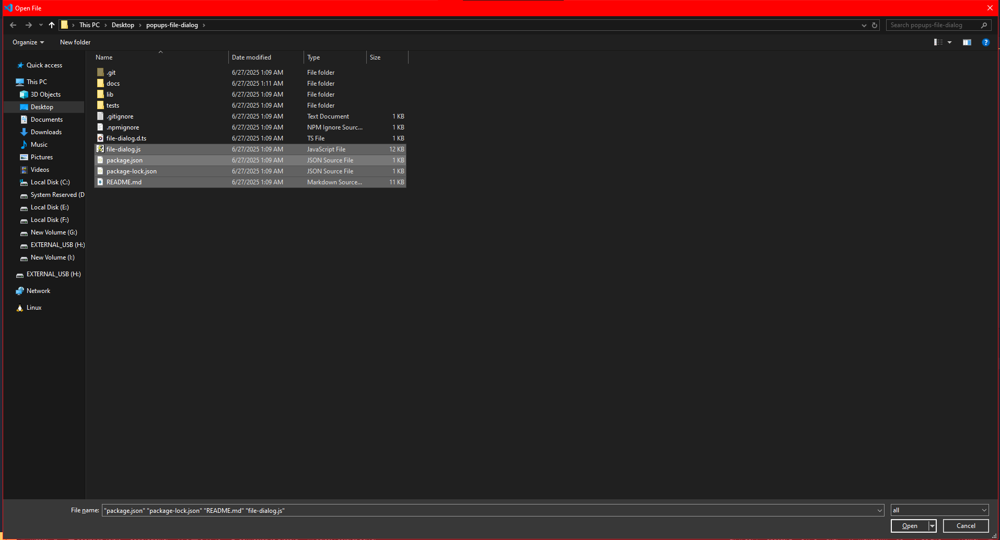
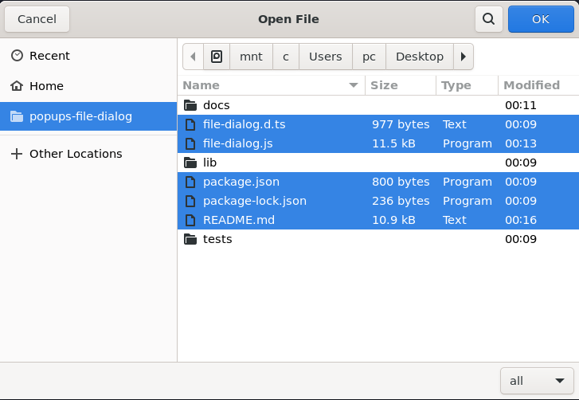
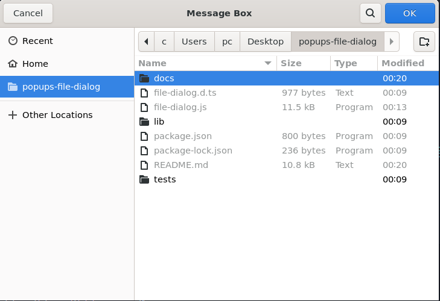
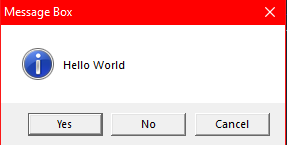

# <span id="popups-file-dialog">Popups File Dialog</span>

## <span id="presentation">Presentation</span>

[![NPM version][npm-version-image]][npm-url]
[![NPM downloads][npm-downloads-image]][npm-downloads-url]
[![MIT License][license-image]][license-url]

_This is a simple file dialog library with 0 dependencies for Windows, Linux and macOS built on a C library called [tinyfiledialogs](tinyfiledialogs)._  
_Since it is built in C, this library is really fast, unlike any Python-based library I have seen on NPM._

Now listen, since Node.JS cannot natively open file dialogs,  I created the CLI version of [tinyfiledialogs](tinyfiledialogs). After that, I built this library as a wrapper for it.  
I did consider making the [tinyfiledialogs](tinyfiledialogs) library a node addon, but that would have been too much work.  
So I went the easy way, and made the CLP version of the library.

I recently built the lib for Windows and Linux.  
I haven’t had the chance to download macOS and build the library for it yet.  
So, if you have a computer running this OS and want to help me, feel free to contribute by compiling and testing the lib/vendors/src/cli.c on macOS.

There’s still a lot of work to do, so feel free to contribute to this lib in general, I can really use some help.  
I am not a pro in C, so I am sure there are a lot of bugs in this lib.

---

## <span id="table-of-content">Table of content</span>
- [Popups File Dialog](#popups-file-dialog)
  - [Presentation](#presentation)
  - [Table of content](#table-of-content)
  - [Demo](#demo)
  - [Installation](#installation)
  - [Change log](#change-log)
    - [1.6.0](#160)
    - [1.5.1](#151)
  - [API](#api)
  - [Usage](#usage)


## <span id="demo">Demo</span>

```js
const fileDialog = require("popups-file-dialog");
(async () => {
  const result = await fileDialog.openFile({
      title: 'Open File',
      startPath: './',
      filterPatterns: ['*'],
      filterPatternsDescription: 'all files',
      allowMultipleSelects: true,
})
  console.log(result);
})();
```
windows: 



linux: 



```js
(async () => {
const result = await fileDialog.openDirectory({
        title: "Message Box",
    })
    console.log(result);
})();
```
windows: 


linux: 




## <span id="installation">Installation</span>


```bash
npm install popups-file-dialog
```

```bash
yarn add popups-file-dialog
```

```bash
git clone https://github.com/native-toolkit/popups-file-dialog.git
cd popups-file-dialog
```

## <span id="change-log">Change log</span>

### <span id="160">1.6.0</span>
- added the saveFile method
- fixed the startPath option for supporting directories with spaces in the name
- some formatting and refactoring

### <span id="151">1.5.1</span>
- add support for linux (finally)
- fixed some bugs (a lot of bugs)
- added the openDirectory method to select a folder
- some formatting and refactoring


## <span id="api">API</span>

View the documentation on [https://eliotttak.github.io/popups-file-dialog](https://eliotttak.github.io/popups-file-dialog)

## <span id="usage">Usage</span>

```js
const fileDialog = require("../file-dialog");

const main = async () => {
  console.log(fileDialog.config.vendorPath); // check for the path of the vendor folder if the os is supported
  const result = await fileDialog.openFile({
    title: "Open File",
    startPath: "C:\\Users\\",
    filterPatterns: ["*.exe", "*.txt"],
    filterPatternsDescription: "exe files,txt files",
    allowMultipleSelects: true,
  });
  console.log(result);

  const result2 = await fileDialog.messageBox({
    title: "Message Box",
    message: "Hello World",
    dialogType: "yesNoCancel",
    iconType: "info",
    defaultSelected: "yes",
  });
  console.log(result2);
};
main();
```

<!-- ### fileDialog.config

super important, and big object, that contain
all the config of the lib
all the flags with the commands
and the path of the vendor folder
part of it:

```js
config = {
  vendorPath: path.join(
    __dirname,
    "lib",
    "vendors",
    "bin",
    `${process.platform}${process.platform === "win32" ? ".exe" : ".app"}`
  ),
  availableCommand: {
    open: {
      name: "-open-file",
      flags: {
        title: {
          name: "--title",
          defaultValue: "open",
        },
        startPath: {
          name: "--startPath",
          defaultValue: path.resolve("./"),
        },
        filterPatterns: {
          name: "--filterPatterns",
          defaultValue: "*",
        },
        filterPatternsDescription: {
          name: "--filterPatternsDescription",
          defaultValue: "",
        },
        allowMultipleSelects: {
          name: "--allowMultipleSelects",
          defaultValue: "0",
        },
      },
    },
  },
};
```
---

### fileDialog.openFile(options)
open file dialog menu

#### _example_ :
multiple select example:
```js
const result = await fileDialog.openFile({
        title: "Open File",
        startPath: "./",
        filterPatterns: ["*"],
        filterPatternsDescription: "all files",
        allowMultipleSelects: true
    })
    console.log(result);

```
image on windows 10:


expected result:
```js
[
  'C:\\Users\\pc\\Desktop\\workingdir\\projects\\popups-file-dialog\\.gitignore',
  'C:\\Users\\pc\\Desktop\\workingdir\\projects\\popups-file-dialog\\.npmignore',
  'C:\\Users\\pc\\Desktop\\workingdir\\projects\\popups-file-dialog\\file-dialog.js'
]
```

#### options
| option | type | default | description         |example|
| ---    | ---  | ---     | ---                 |---    |
| title  |string| "open"  | title of the dialog | "Open File" |
| startPath | string | path.resolve("./") | start path of the dialog | "C:\\Users\\" |
| filterPatterns | string[] | ["*"] | filter patterns of the dialog | ["\*.exe", "\*.txt"] |
| filterPatternsDescription | string | "" | filter patterns description of the dialog | "exe files,txt files" |
| allowMultipleSelects | boolean | false | allow multiple selects of the dialog | true |

---

### fileDialog.saveFile(options)
save file dialog menu

#### _example_ :
```js
const result5 = await fileDialog.saveFile({
      title: 'Save File',
      startPath: 'C:\\Users\\pc\\Desktop\\New folder (36)\\test.txt',
      filterPatterns: ['*'],
      filterPatternsDescription: "all",
   })
   console.log(result5)
```
image on windows 10:


expected result:
```js
"C:\\Users\\pc\\Desktop\\New folder (36)\\test.txt"
```
#### options
| option | type | default | description         |example|
| ---    | ---  | ---     | ---                 |---    |
| title  |string| "save"  | title of the dialog | "Save File" |
| startPath | string | path.resolve("./default.txt") | start path and file name | "C:\\Users\\someFile.txt" |
| filterPatterns | string[] | ["*"] | filter patterns of the dialog | ["\*.exe", "\*.txt"] |
| filterPatternsDescription | string | "" | filter patterns description of the dialog | "exe files,txt files" |

---

### fileDialog.openDirectory(options)
open folder dialog menu

#### _example_ :
```js
const result = await fileDialog.openDirectory({
        title: "Message Box",
    })
    console.log(result);
```
image on windows 10:


expected result:
```js
"C:\\Users\\pc\\Documents\\Adobe"
```

#### options
| option | type | default | description         |example|
| ---    | ---  | ---     | ---                 |---    |
| title  |string| "open"  | title of the dialog | "Open Folder" |

---

### fileDialog.messageBox(options)
promote message box

#### _example_ 1:
```js
const result = await fileDialog.messageBox({
        title: "Message Box",
        message: "Hello World",
        dialogType: "yesNoCancel",
        iconType: "info",
        defaultSelected: "yes"
    })
    console.log(result);
```
image on windows 10:



expected result:
```js
yes -> 1
no -> 2
cancel -> 0
```

#### _example_ 2:
```js
const result = await fileDialog.messageBox({
        title: "Message Box",
        message: "Hello World",
        dialogType: "okCancel",
        iconType: "info",
        defaultSelected: "ok"
    })
    console.log(result);
```
expected result:
```js
ok -> 1
cancel -> 0
```
#### _example_ 3:

```js
const result = await fileDialog.messageBox({
        title: "Message Box",
        message: "Hello World",
        dialogType: "yesNo",
        iconType: "info",
        defaultSelected: "ok"
    })
    console.log(result);
```
expected result:
```js
yes -> 1
no -> 0
```

#### options
| option | type | default | description         |example| available options |
| ---    | ---  | ---     | ---                 |---    | --- |
| title  |string| "message"  | title of the dialog | "Message Box" | |
| message | string | "message" | message of the dialog | "Hello World" | |
| dialogType | string | "ok" | dialog type of the dialog | "okCancel" | "ok", "okCancel", "yesNo", "yesNoCancel" |
| iconType | string | "info" | icon type of the dialog | "info" | "info", "warning", "error","question" |
| defaultSelected | string | "ok" | default selected of the dialog | "ok" | "ok", "cancel", "yes", "no" | -->

---

[license-image]: https://img.shields.io/badge/license-ISC-blue.svg?style=flat
[license-url]: LICENSE

[npm-url]: https://npmjs.org/package/popups-file-dialog
[npm-version-image]: https://img.shields.io/npm/v/popups-file-dialog.svg?style=flat

[npm-downloads-image]: https://img.shields.io/npm/dm/popups-file-dialog.svg?style=flat
[npm-downloads-url]: https://npmcharts.com/compare/popups-file-dialog?minimal=true
[tinyfiledialogs]: https://github.com/native-toolkit/libtinyfiledialogs